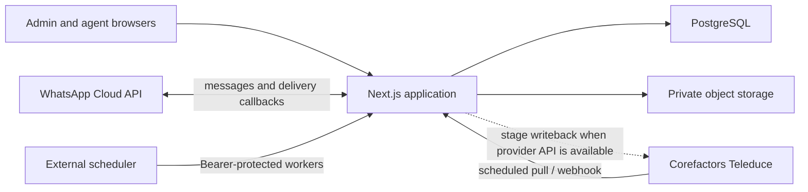

# Franch Realty Platform

Franch Realty Platform is an internal operations application for property inventory, Corefactors Teleduce leads, lead assignment, locality-aware property matching, customer conversations, and administrative oversight.

The application is a single Next.js service backed by PostgreSQL and private object storage. It supports Hyderabad and Chennai, enforces role and city boundaries on the server, and keeps an audit trail for important state changes.

## Capabilities

- Property inventory: create, edit, filter, bulk import/export, attach images and documents, and generate branded portfolio PDFs.
- CRM lead ingestion: scheduled full reconciliation and real-time Corefactors webhooks with idempotent upserts and archive safeguards.
- Assignment: Corefactors owners remain authoritative; genuinely ownerless leads use an even-load, locality-aware assignment policy.
- Matching: lead-to-property and property-to-lead discovery using hard requirement filters and locality distance bands.
- Match history: shortlist/share/close outcomes, criteria snapshots, immutable history, and a Teleduce writeback queue.
- Customer messaging: exclusive per-lead WhatsApp conversations, queued delivery, property sharing, status callbacks, and admin oversight.
- Administration: users, roles, city/area scope, locality master, notifications, audit log, backups, and bulk operations.

## System overview



## Technology

| Concern | Implementation |
|---|---|
| Web application | Next.js 16 App Router, React 19, TypeScript |
| Data access | PostgreSQL, Prisma 6, committed migrations |
| Authentication | Auth.js 5 credentials, bcrypt password hashes, JWT sessions |
| Validation | Zod |
| Styling | Tailwind CSS 4 |
| Object storage | MinIO/R2 through S3, or Azure Blob Storage |
| Files | ExcelJS, React PDF, Sharp |
| Integrations | Corefactors Teleduce and WhatsApp Business Cloud API |
| Packaging | Multi-stage Docker image with Next.js standalone output |
| Tests | Node test runner through `tsx` |

## Quick start

Requirements:

- Node.js 22 or newer
- Docker Desktop
- npm

```bash
# Copy the safe local template
cp .env.example .env
# PowerShell: Copy-Item .env.example .env

# Start PostgreSQL and MinIO
docker compose up -d

# Install exact locked dependencies
npm ci

# Generate Prisma Client and apply migrations
npm run db:generate
npm run db:deploy

# Add localities, synthetic users, demo inventory, and mock leads
npm run db:seed

# Start the application
npm run dev
```

Open [http://localhost:3100](http://localhost:3100). The default synthetic admin is `admin@example.com`. Its password is the local `SEED_DEFAULT_PASSWORD` value. These accounts and credentials are for local demonstrations only.

Local services:

| Service | Address |
|---|---|
| Application | `http://localhost:3100` |
| PostgreSQL | `localhost:5433` |
| MinIO API | `http://localhost:9100` |
| MinIO console | `http://localhost:9101` |

## Commands

| Command | Purpose |
|---|---|
| `npm run dev` | Start the development server on port 3100 |
| `npm run build` | Produce the production Next.js build |
| `npm run start` | Serve a local production build on port 3100 |
| `npm run lint` | Run ESLint |
| `npm run typecheck` | Run TypeScript without emitting files |
| `npm test` | Run unit and database integration tests serially |
| `npm run db:generate` | Generate Prisma Client |
| `npm run db:migrate` | Create/apply a migration during development |
| `npm run db:deploy` | Apply committed migrations without resetting data |
| `npm run db:seed` | Seed local reference data and optional demo data |
| `npm run db:studio` | Open Prisma Studio |
| `npm run teleduce:pull` | Run CRM reconciliation and due writebacks manually |

## Repository map

```text
.
|-- prisma/
|   |-- migrations/          # Forward-only database migration history
|   |-- schema.prisma        # Models, relations, indexes, and enums
|   `-- seed.ts              # Localities and synthetic demonstration data
|-- public/                  # Brand assets and fonts
|-- scripts/
|   `-- run-teleduce-pull.ts # Supported operational CLI runner
|-- src/
|   |-- app/                 # Pages, route handlers, and server actions
|   |-- components/          # Feature and shell UI components
|   |-- data/                # Locality reference data
|   |-- lib/                 # Domain, data, integration, PDF, and service logic
|   |-- types/               # Auth.js type augmentation
|   |-- instrumentation.ts   # Process-level structured error logging
|   `-- proxy.ts             # Auth.js route protection
|-- tests/                   # Unit and PostgreSQL integration tests
|-- Dockerfile               # Production application image
|-- Dockerfile.migrate       # One-shot migration image
|-- docker-compose.yml       # Local PostgreSQL and MinIO
`-- .env.example             # Safe configuration template
```

## Documentation

| Document | Use it for |
|---|---|
| [Architecture](docs/ARCHITECTURE.md) | System design, module behavior, security boundaries, and extension points |
| [Database](docs/DATABASE.md) | Models, relationships, constraints, migrations, and seed behavior |
| [API reference](docs/API_REFERENCE.md) | HTTP endpoints, server actions, authentication, and worker contracts |
| [Development](docs/DEVELOPMENT.md) | Local setup, configuration, testing, and change workflow |
| [Deployment](docs/DEPLOYMENT.md) | Production container, database, storage, workers, health checks, and rollback |
| [Operations runbook](docs/RUNBOOK.md) | Sync, assignment, messaging, backups, rotation, and troubleshooting |
| [User guide](docs/USER_GUIDE.md) | Day-to-day instructions for admins and agents |
| [Handover](docs/HANDOVER.md) | Ownership transfer, known boundaries, go-live, and enhancement checklist |

## Important integration status

- Teleduce lead retrieval and webhook ingestion are implemented.
- The live Corefactors adapter is intentionally read-only until Corefactors supplies a supported lead-stage update endpoint. Share/close decisions remain safely `PENDING`; see the runbook and handover guide.
- WhatsApp messages are sent live only when all required Cloud API credentials are configured. Otherwise they are stored as `QUEUED` and can be delivered by the outbox worker after configuration.
- Production mock CRM mode is rejected unless `TELEDUCE_ALLOW_MOCK=true` is set deliberately.

## Data and credential policy

No real `.env`, API credentials, production exports, client workbooks, message data, or attachment files belong in Git. The repository ignores local environment files and the `reference/` directory. Transfer production credentials through the client's approved secret manager.

This repository contains proprietary project code and intentionally has no open-source license.
