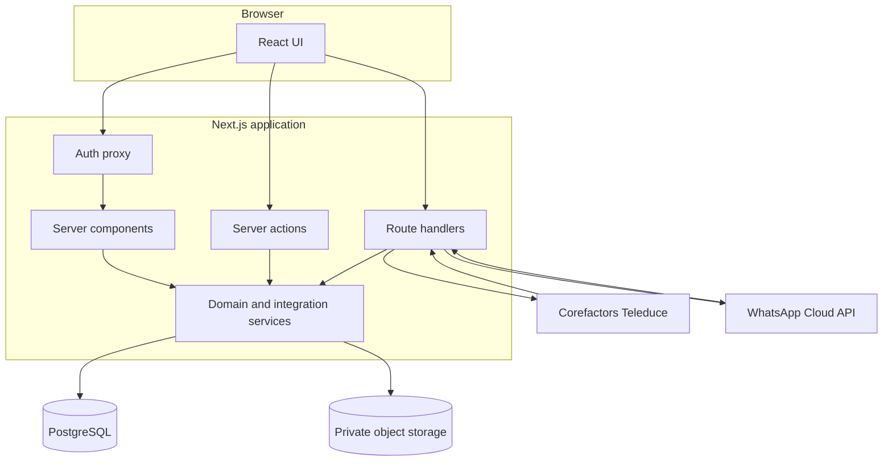

# Architecture

This document explains how the application is organized, how requests and background events move through it, where security is enforced, and which files to change for common enhancements.

## 1. Architectural style

The platform is a modular monolith:

- Next.js renders the UI and exposes route handlers and server actions.
- PostgreSQL is the authoritative application database.
- Prisma owns schema access and migrations.
- Private object storage holds property images, brochures, and floor plans.
- External systems enter through adapters and authenticated webhook/worker routes.

This design keeps deployment simple while preserving clear feature boundaries under `src/lib`.

## 2. Request and authorization lifecycle

1. `src/proxy.ts` applies the Auth.js proxy to browser pages and redirects unauthenticated users to `/login`.
2. API routes are excluded from the proxy matcher. Each route performs its own authentication because an excluded matcher also excludes server-function protection.
3. Pages and actions call `requireUser`, `requireAdmin`, or `currentUser` from `src/lib/auth-helpers.ts`.
4. `currentUser` resolves the JWT principal and re-reads the database user on every request. Deactivation, role changes, and city changes therefore take effect immediately.
5. Agents are scoped by city at query and mutation boundaries. Admins can operate across both supported cities.
6. Webhooks validate provider secrets or signatures. Scheduled workers require `Authorization: Bearer <CRON_SECRET>`.

Credentials authentication is implemented in `src/lib/auth.ts`:

- emails are normalized to lowercase;
- password hashes use bcrypt cost 12;
- unknown users still execute a dummy bcrypt comparison to reduce account enumeration;
- database-backed email/IP failure counters enforce a 15-minute lock window;
- JWT sessions expire after eight hours.

## 3. Application modules

### 3.1 Inventory

Primary code:

- `src/app/(app)/inventory`
- `src/components/inventory`
- `src/lib/queries/inventory.ts`
- `src/lib/validation/property.ts`
- `src/lib/import/book1.ts`
- `src/lib/storage.ts`
- `src/lib/pdf`

Properties use a unique `fileNo` and belong to a city and locality. Reads exclude `deletedAt` records. Normal deletion is a soft delete so match history remains available; attachments are removed from storage on a best-effort basis.

Uploads are handled by server actions. The implementation:

- limits images to 5 MB and documents to 20 MB;
- accepts JPEG, PNG, GIF, WebP, and PDF;
- validates file signatures with magic bytes instead of trusting the browser MIME type;
- stores opaque object keys;
- serves files only through `/api/attachments/[id]`, which rechecks the user and property city;
- forces non-image files to download, except authenticated PDF previews.

The Excel importer has a two-step trust boundary:

1. Preview parses and validates the workbook server-side, then stores mapped rows in `ImportBatch`.
2. Commit takes only the batch ID, rereads the stored rows, and writes valid records.

The client never posts a trusted serialized preview back to the commit action. The generated template route is the canonical workbook format.

Portfolio PDFs are generated on demand from current property data. Images are fetched from private storage, normalized through Sharp, and embedded by React PDF.

### 3.2 Teleduce lead ingestion

Primary code:

- `src/lib/teleduce/corefactors-client.ts`
- `src/lib/teleduce/sync.ts`
- `src/lib/teleduce/mapping.ts`
- `src/lib/teleduce/requirement-parser.ts`
- `src/app/api/teleduce/webhook/route.ts`
- `src/app/api/sync/teleduce/pull/route.ts`

There are two ingestion paths:

- Full pull: the Corefactors adapter paginates `POST /lead/retrieval/` in batches of 100, with a 30-second request timeout and a 25,000-record safety cap.
- Webhook: a signed/shared-secret request maps one or more lead records and uses the same upsert function.

Both paths normalize into `TeleduceLead`, infer missing structured values from requirement text, map localities, and upsert by the unique `teleduceLeadId`.

The scheduled pull is a full reconciliation because missing upstream leads must be detected. Soft archive runs only when:

- every mapped row completed without failure; and
- the pulled set is at least 50% of the current active CRM set.

That retain-ratio guard prevents a truncated provider response from mass-archiving valid leads. A maximum of 50 per-lead notifications is emitted in one pull so a bulk load cannot flood the UI.

`DeletedTeleduceLead` is a suppression ledger. When an admin permanently deletes a CRM lead, later pulls and webhooks skip that upstream ID.

### 3.3 Lead ownership and assignment

Primary code:

- `src/lib/leads/corefactors-owner.ts`
- `src/lib/leads/assignment.ts`
- `src/app/(app)/leads/actions.ts`
- `src/lib/queries/leads.ts`

Assignment precedence is:

1. If Corefactors supplies an owner that resolves to an active platform agent, the lead is assigned to that user with source `COFACTORS`.
2. If Corefactors supplies an owner that cannot be resolved, the lead remains locally unassigned. The platform does not override an authoritative upstream owner.
3. If no Corefactors owner exists, the local even-load policy can assign the lead with source `ROUND_ROBIN`.
4. An admin may override assignment with source `MANUAL`.

Eligible agents must be active, have role `AGENT`, and cover the lead's city. Area assignments narrow the pool when they overlap the lead's preferred localities; agents with no assigned areas cover their whole city. If no area match exists, the policy falls back to all agents for that city.

The chosen user has the fewest active assigned leads. Ties use the least-recent assignment and then user ID. A PostgreSQL advisory transaction lock serializes each city's assignment calculation during concurrent webhook/pull bursts.

Agents maintain a working status and note independently from the read-only CRM pipeline stage. Returning a lead requires a reason and creates `LeadUnassignment` history for admin follow-up.

### 3.4 Matching

Primary code:

- `src/lib/matching.ts`
- `src/lib/matching-service.ts`
- `src/lib/match-filters.ts`
- `src/app/(app)/matching`
- `src/components/matching`

`matching.ts` is pure, database-independent logic. `matching-service.ts` loads city-scoped database records, converts Prisma values to matching inputs, and supports both directions.

Every candidate must pass these hard filters:

- same city;
- property is available;
- selected transaction type;
- selected property type;
- selected BHK, with default tolerance of plus/minus one;
- budget overlap, with default tolerance of plus/minus 10%.

Working filters can set exact BHK/budget behavior and add building classification, furnishing, minimum area, and parking constraints before the pure engine runs.

Distance uses Haversine calculations between locality centroids:

| Band | Definition |
|---|---|
| 0 | Exact locality ID |
| 1 | Different locality, at most 3 km |
| 2 | More than 3 km and at most 5 km |
| 3 | Beyond 5 km or no locality anchor |

Within a band, results sort by exact-criteria score, distance, then property recency. Actioning a match recomputes its band and criteria on the server; values from the browser are never trusted.

### 3.5 Match persistence and CRM writeback

Primary code:

- `src/app/(app)/matching/actions.ts`
- `src/lib/teleduce/writeback.ts`
- `src/lib/teleduce/mapping.ts`

`Match` is unique per lead/property pair and represents current state. `MatchHistory` is append-only and records every change with the criteria snapshot.

Statuses map to CRM stages:

| Match status | CRM behavior |
|---|---|
| `SHORTLISTED` | Internal only; no writeback |
| `SHARED` | Intended stage: Contacted and Details Shared |
| `CLOSED_WON` | Intended stage: Registration completed |
| `CLOSED_LOST` | Intended stage: Contacted but not interested |
| `CLOSED_NEUTRAL` | Intended stage: Suitable property not available |

When a write-capable adapter exists, the queue uses an atomic claim, an eight-attempt limit, exponential backoff from 10 minutes to 6 hours, and a two-minute processing lease. The current live Corefactors adapter advertises `canWriteback=false` because no supported stage-update API has been supplied. Intent is retained as `PENDING` without retry churn.

### 3.6 WhatsApp conversations

Primary code:

- `src/lib/whatsapp/client.ts`
- `src/lib/whatsapp/conversations.ts`
- `src/lib/whatsapp/phone.ts`
- `src/app/api/whatsapp`
- `src/app/(app)/leads/[id]/conversation`
- `src/app/(app)/oversight`

A partial unique index allows only one `ACTIVE` conversation per lead. Starting a conversation therefore acts as a cross-replica lock. The owning agent can send; admins have read-only oversight and can end a conversation.

Outbound text is:

- sent immediately when Cloud API credentials exist;
- recorded as `QUEUED` when unconfigured or a transient send fails;
- retried by the outbox worker;
- marked `FAILED` after 24 hours.

Inbound webhook requests require `X-Hub-Signature-256`. Inbound messages extend the stored 24-hour customer-care window. Delivery callbacks advance message status monotonically from sent to delivered/read or failed.

Property sharing records both the outbound message and an immutable snapshot of the property at sharing time. Search activity is also logged so oversight can reconstruct what the agent saw.

### 3.7 Notifications, audit, export, and backup

- New-lead notifications come from both webhook and scheduled pull paths and are retained for 90 days.
- `AuditLog` captures user and system changes without recording passwords or password hashes.
- Admin exports use POST bodies so large filter selections do not appear in URLs.
- Property exports match the importer columns and can be re-imported.
- Bulk operations cap selection sizes in `src/lib/bulk-delete.ts`.

## 4. Data consistency patterns

- Unique constraints protect user email, property file number, CRM lead ID, locality identity, match pairs, and WhatsApp message IDs.
- Multi-record changes use Prisma transactions.
- Last-active-admin and concurrent role changes use serializable transactions.
- Assignment uses PostgreSQL advisory locks.
- Server actions revalidate affected routes after writes.
- Storage cleanup is best-effort after database state is secured; database failure never silently removes the authoritative row.
- Audit and notification writes are best-effort only where failing the external webhook would cause harmful provider retries.

## 5. Runtime and packaging

`next.config.ts` enables standalone output. `Dockerfile` builds with Node 22 Alpine and runs as a non-root `nextjs` user. `Dockerfile.migrate` contains the Prisma CLI and is intended as a one-shot deployment job.

`src/instrumentation.ts` installs process-level structured logging. `/api/health` checks both process availability and database connectivity.

The application requires an external scheduler for:

- `/api/sync/teleduce/pull` every 30 minutes;
- `/api/whatsapp/process-outbox` every few minutes when WhatsApp is enabled.

## 6. Safe extension points

### Add a property field

1. Add the field to `prisma/schema.prisma` and create a migration.
2. Update `src/lib/validation/property.ts`.
3. Update `PropertyForm`, inventory queries/cards, importer/exporter if applicable, and portfolio PDF sections.
4. Add unit/import tests and run the complete validation suite.

### Add a city

1. Add the enum value in Prisma and migrate.
2. Extend `CITIES`, labels, and city center in `src/lib/domain.ts`.
3. Add locality reference data.
4. Review CRM city inference, user city scopes, assignment lock keys, filters, seed data, and tests.

### Change CRM field mapping

1. Update `src/lib/teleduce/corefactors-client.ts` for raw payload extraction.
2. Update `mapping.ts` or `requirement-parser.ts`.
3. Add fixtures/tests for the new provider shape.
4. Run a read-only mapping validation before enabling it in production.

### Enable CRM writeback

1. Obtain the supported endpoint, authentication method, payload, response contract, and idempotency behavior from Corefactors.
2. Implement `updateLeadStage` in `corefactors-client.ts`.
3. Set `canWriteback=true`.
4. Add adapter contract tests and a sandbox integration test.
5. Test one lead in a non-production pipeline before releasing the pending queue.

### Add a storage provider

Implement the internal `StorageProvider` contract in `src/lib/storage.ts`, add validated environment fields, and select it in `provider()`. No feature call sites should need to change.
