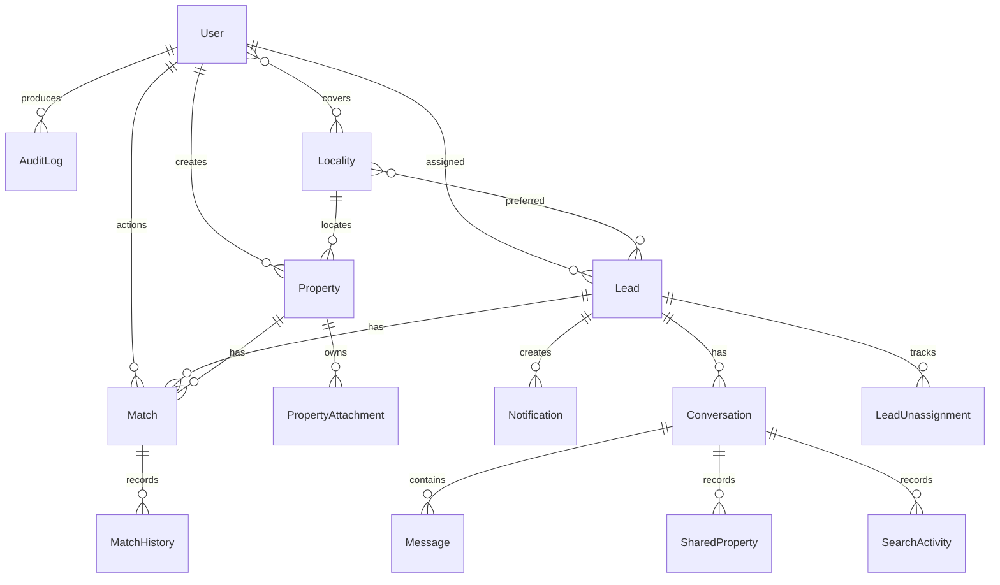

# Database Guide

PostgreSQL is the system of record for application state. Prisma defines the schema in `prisma/schema.prisma`; production changes are applied only through committed migrations in `prisma/migrations`.

## 1. Relationship overview



## 2. Model catalogue

| Model | Purpose | Important rules |
|---|---|---|
| `User` | Login identity, role, city/area access, assignment ownership | Unique email; users are deactivated rather than deleted |
| `Locality` | City locality, centroid, and optional CRM label | Unique city/name and unique optional Teleduce value |
| `Property` | Inventory listing | Unique file number; soft deletion through `deletedAt` |
| `PropertyAttachment` | Object-storage metadata | Cascades when the owning property is hard-deleted |
| `Lead` | Local CRM projection and assignment state | Unique optional Teleduce ID; upstream fields and local working fields are separate |
| `LeadUnassignment` | Agent return-to-pool history | Preserves reason, creator, and optional admin dismissal |
| `DeletedTeleduceLead` | Permanent upstream suppression ledger | Primary key is Teleduce lead ID |
| `Match` | Current lead/property match outcome | Unique lead/property pair; stores current criteria and writeback state |
| `MatchHistory` | Immutable match status timeline | Cascades with its match |
| `ImportBatch` | Server-side staged inventory import | Prevents client-side preview tampering |
| `SyncLog` | Pull/writeback execution history | Powers dashboard health and operations diagnostics |
| `LoginAttempt` | Authentication abuse control | Indexed by email/IP and time |
| `AuditLog` | User/system change history | Stores before/after JSON; password material is never included |
| `Notification` | New-lead notification history | Read state is global to admins; retention is 90 days |
| `Conversation` | Exclusive agent/customer work session | A migration-level partial unique index enforces one active conversation per lead |
| `Message` | Inbound/outbound WhatsApp event | Unique optional WhatsApp message ID deduplicates callbacks |
| `SharedProperty` | Property shared during a conversation | Saves a point-in-time JSON snapshot |
| `SearchActivity` | Match search performed in a conversation | Stores criteria and result IDs for oversight |

## 3. Important enums

| Domain | Values |
|---|---|
| Role | `ADMIN`, `AGENT` |
| City | `HYDERABAD`, `CHENNAI` |
| Transaction | `SALE`, `RENT` |
| Property | `APARTMENT`, `VILLA`, `PLOT`, `COMMERCIAL` |
| Availability | `AVAILABLE`, `BOOKED`, `SOLD`, `RENTED` |
| Match | `SHORTLISTED`, `SHARED`, `CLOSED_WON`, `CLOSED_LOST`, `CLOSED_NEUTRAL` |
| Writeback | `NOT_REQUIRED`, `PENDING`, `SUCCESS`, `FAILED` |
| Assignment source | `COFACTORS`, `ROUND_ROBIN`, `MANUAL` |
| Assignment status | `NEW`, `ATTEMPTED`, `CONTACTED`, `SITE_VISIT_SCHEDULED`, `VISITED`, `NEGOTIATING`, `CLOSED_WON`, `CLOSED_LOST` |
| Conversation | `ACTIVE`, `ENDED` |
| Message direction | `INBOUND`, `OUTBOUND` |
| Message status | `QUEUED`, `SENT`, `DELIVERED`, `READ`, `FAILED`, `RECEIVED` |

See the schema for property usage, building classification, price unit, furnishing, attachment kind, sync, and message-type enums.

## 4. Lead state separation

The `Lead` model intentionally contains three distinct concepts:

- CRM state: `currentStage`, `teleduceStageId`, `leadOwner`, and `rawPayload` mirror Corefactors.
- Platform ownership: `assignedAgentId`, `assignedAt`, and `assignmentSource`.
- Agent working state: `assignmentStatus` and `assignmentNote`.

Do not merge these fields. Updating an agent's working status must not rewrite the CRM pipeline stage, and a scheduled CRM pull must not erase local working notes.

## 5. Match and writeback state

`Match` stores the latest status for a unique lead/property pair. Each change also creates `MatchHistory`, so the application can update the current row without losing training/audit history.

Writeback fields form a database queue:

- `teleduceWritebackStatus`
- `teleduceWritebackAt`
- `teleduceWritebackAttempts`
- `teleduceWritebackNextRetryAt`

The retry scan index covers status plus next-retry time.

## 6. Deletion behavior

- Property delete is normally soft: `deletedAt` is set and active queries exclude the row.
- CRM lead bulk delete can create a `DeletedTeleduceLead` suppression row before removal so future ingestion cannot recreate it.
- Users are deactivated to preserve assignment and audit context.
- Localities cannot be deleted while properties, leads, or agent areas reference them.
- Conversations/messages and matches use cascade behavior where child data has no independent meaning.
- Object blobs are outside PostgreSQL. Their deletion is best-effort and should be included in backup/retention planning.

## 7. Index and constraint strategy

The schema includes indexes for:

- city/status/type inventory filters;
- locality/type/BHK matching;
- lead stage, archive, recency, and assignment queries;
- match lookup in both directions;
- due CRM writebacks;
- audit and sync timelines;
- login lockout windows;
- notification recency/read state;
- conversation ownership and activity;
- outbound message queue scans.

Database constraints are the final concurrency boundary. Application checks provide friendly errors, but unique indexes and foreign keys remain authoritative.

## 8. Migration workflow

During development:

```bash
# Edit prisma/schema.prisma, then create and apply a migration
npm run db:migrate -- --name describe_the_change

# Regenerate Prisma Client
npm run db:generate

# Validate the full application
npm run typecheck
npm test
npm run build
```

In production:

```bash
npm run db:deploy
```

Never run `prisma migrate dev`, `prisma migrate reset`, or `db push` against production.

Before a production migration:

1. Take a database snapshot or verify point-in-time restore.
2. Review generated SQL for locks, table rewrites, destructive clauses, and backfills.
3. Test against a recent sanitized copy at realistic volume.
4. Deploy schema before code when the change is backward compatible, or use an expand/migrate/contract sequence.

## 9. Migration history

The committed history starts with the core inventory/lead/match schema and incrementally adds:

- writeback backoff;
- RERA identifiers;
- WhatsApp conversations and agent areas;
- performance indexes and login attempts;
- match history and import batches;
- notifications and lead recency;
- building/locality metadata;
- lead assignment and agent workflow;
- permanent CRM lead suppression;
- Corefactors assignment provenance.

The directory name timestamp establishes order. Never edit a migration that has been applied to a shared environment; create a new corrective migration.

## 10. Seeding

`prisma/seed.ts` is deterministic and idempotent for its generated records.

- It always upserts the locality master and synthetic demonstration users.
- `SEED_MOCK_INVENTORY=true` also creates demonstration properties, mock CRM leads, and matches.
- `SEED_DEFAULT_PASSWORD` controls the synthetic account password.
- Production execution with `NODE_ENV=production` refuses to run unless `SEED_DEFAULT_PASSWORD` is explicitly set.

The synthetic emails use `example.com`; no client user identity is stored in the repository. Create real users through the admin UI or a controlled client-owned provisioning script. Align agent email/name values with Corefactors owner strings before enabling live ingestion.

## 11. Backup and restore

A complete backup includes:

- PostgreSQL logical backup or managed snapshot;
- private object-storage container/bucket and metadata;
- deployment environment variable names and secret references;
- the exact Git commit and image digest.

Restore order:

1. Restore/provision PostgreSQL.
2. Restore object storage with the same keys.
3. Set application secrets and provider configuration.
4. Run `prisma migrate deploy`.
5. Deploy the matching application version.
6. Verify `/api/health`, login, a private attachment, and a read-only CRM sync.
